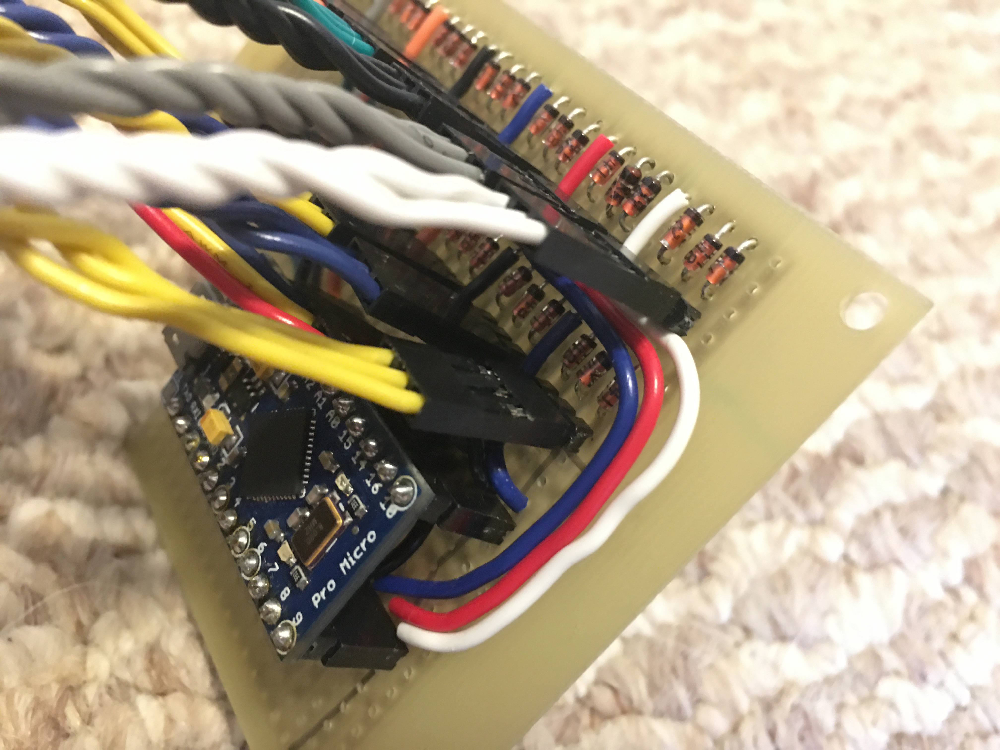

 I made this project for my partners work in childcare. She has a classroom of toddlers and while they enjoy the musical toys they have, some of them are not robust enough for long term use. In addition most musical toys are limited to simpler instruments that translate well into a small toy. To make this controller robust I have used standard arcade buttons rated for ten million presses and the case will be constructed from 1/2 inch plywood. The controller is using the QMK firmware to easily implement NKRO and MIDI signals.

 Connections between keys and the controller use quick disconnect terminals for ease of use when replacing parts in the controller. The diodes required for the NKRO are populated on a peice of perf board that has connections for each note and octave to create a switch matrix. Firmware is loaded on an ATMega32u4 microcontroller via the onboard programmer.

 I have planned to add a seperate multi function pedal to the project using an industrial foot switch and some toggle switches. It will use its own microcotroller running QMK to simplify the setup and allow the two controllers to work as standalone tools.

